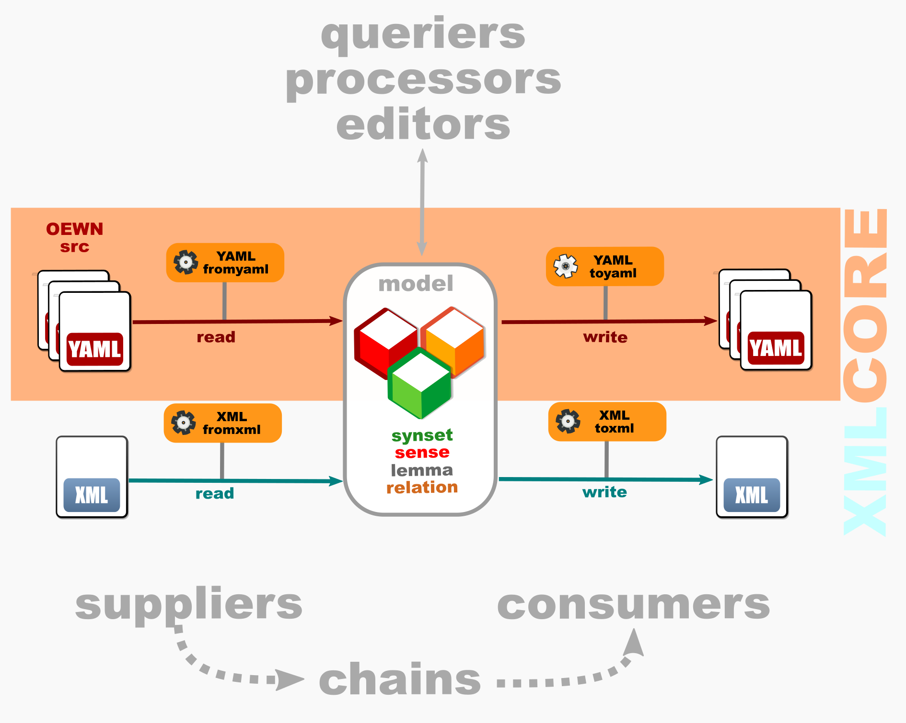

# Open English Wordnet core Python toolkit

This project's purpose is to provide basic load/save utilities in Python for Open English Wordnet models. 

The starting point is a number of Python scripts written by JohnMcCrae that used to come with OEWN source.
These have been reworked.

## Dataflow

## Bare-Bones, No-Frills

Unused code has been trimmed.

In the model, **IDs are not transformed** — there is no mangling to make them valid XML IDs: 
* sense IDs are the **sensekey**s, 
* synset IDs are the **synsetid**s, 
* entries have no ID — they use **(lemma, pos, discriminant)** for resolution 
where _discriminant_ is the possible _indexing_ appended to the part-of-speech, for example:
(bass,a,None)
(bass,n,1)
(bass,n,2)

One-field classes have been replaced with this field.

No processing nor editing of model is performed: it's up to other tools to do it.

No validation of model is performed: it's up to other tools to do it.

If anything goes wrong, the language and libraries will raise their own exceptions. 
However, some exceptions are raised when a requested operation can't carry on.

It is not considered inherent to the model to be exported to XML. 
So the model is **XML-agnostic**. XML legacy has been ditched except when it comes to XML exporting / importing in the dedicated reader and writer.

## Modular

Design is modular: modules do not depend on each other except model. Chains however
use a supplier and a consumer.

## Typed

Variables are typed to make the code readable and document it.

## No-deps

No deps but YAML (pip install PyYAML)

## Late resolution

Internal cross-dependencies are resolved at a later stage. If resolution is not necessary, this stage may be ignored. This involves 
- the resolution of synsetids in senses to synsets
- the resolution of members in synsets to entries
- the resolution of targets in relations to senses or synsets

The resolved entities are stored as **resolved_*** class members in the object.

## Late extension

Optional extension of relation sets with the addition of inverse relations (if inversable) is possible at a later stage, if needed.

## Modules ##

**Model**

- [model](core/wordnet.py) : Model

**Suppliers**:  YAML/XML/pickle

- [fromyaml](core/wordnet_fromyaml.py) : Supply model from YAML
- [fromxml](xml/wordnet_fromxml.py) : Supply model from (one-file) XML

**Consumers**: YAML/XML/pickle

- [toyaml](core/wordnet_toyaml.py) : Consume model to YAML
- [toxml](xml/wordnet_toxml.py) : Consume model to (one-file) XML

**Supplier-consumer chains**: YAML2YAML, YAML2XML, XML2YAML

- [yaml_to_yaml](core/yaml_to_yaml.py) : Chain from YAML supplier to YAML consumer (side effect is normalization)
- [yaml_to_xml](xml/yaml_to_xml.py)  : Chain from YAML supplier to XML consumer (conversion from XML)
- [xml_to_yaml](xml/xml_to_yaml.py)  : Chain from XML supplier to YAML consumer (conversion to YAML)

## XML extensions ##

While still conforming to [WN-LMF-1.1.dtd](https://github.com/globalwordnet/schemas/blob/master/WN-LMF-1.3.dtd),

* **wikidata** in synsets is exported in the _dc:subject_ attribute
* **sent** in synsets is exported as \<Example>
* **dc:date** in \<Lexicon> receives the date of XML generation
* **dc:identifier** in \<Lexicon> receives a UID (and is thus unique)

## Testing ##

* yaml → model → yaml
* yaml → model → xml → model → yaml 
* yaml → pickle → yaml

must produce identical input and output at the ends of the chains

XML single output file must validate against [WN-LMF-1.1.dtd](https://github.com/globalwordnet/schemas/blob/master/WN-LMF-1.3.dtd)

## Authorship ##

Original code was written by John McCrae <john@mccr.ae>
Bernard Bou revised, trimmed, revamped it <1313ou@gmail>.

## Licence ##

Licence is CC-4 for original code.

License is GPL-3 for revisions.

## Related ##

The [oewntk project](https://github.com/oewntk/oewntk) is a tool suite written in Kotlin for JVM, 
that has similar design principles. Most notably, it exports to SQL, WNDB and JSON formats.